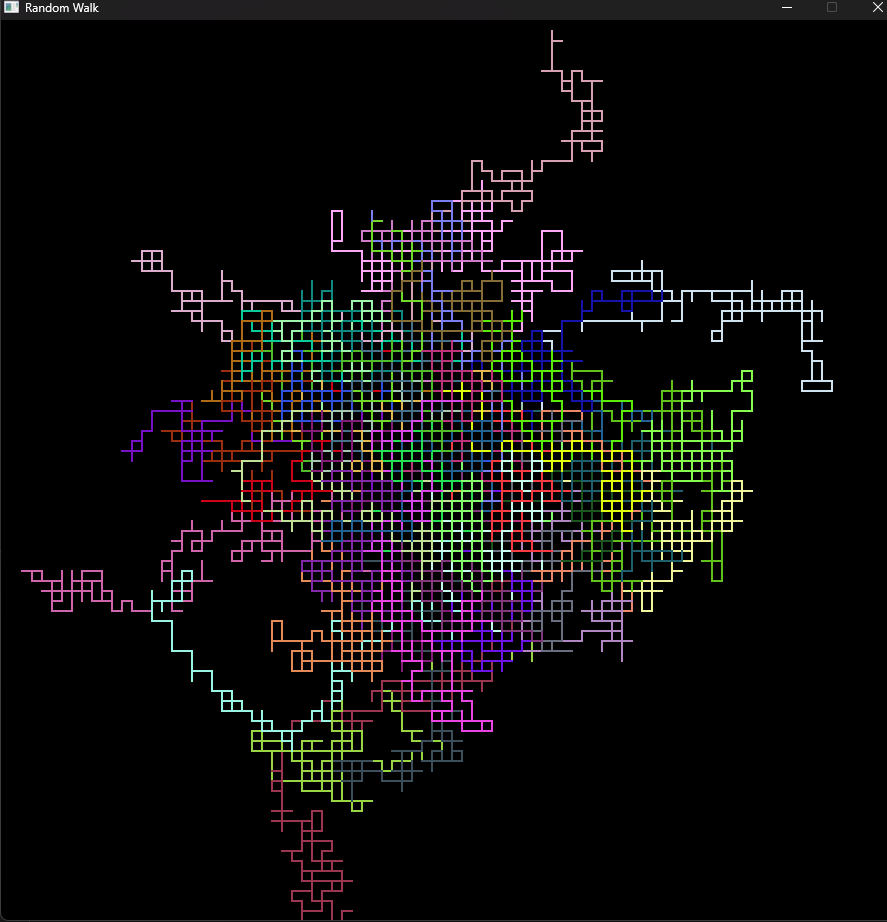

# Random Walk Simulation:

## Preview:

## Tech Stack Used:
- `SDL3`
- `C`

## Installation / Executing Guide:

1. Run the make file this will run the command to make the executable using the SDL library

2. run program (num of agents) to specify how many agents you want to simulate if you do not specify it will default to 5.
